

# Remote PC Power Button

A wireless power button for a PC. A button on the desk switches the PC on and off, and its LED shows whether the PC is running. Inside the PC, a second unit closes the motherboard's power switch and senses the PC's power. The two units talk directly over ESP-NOW, so the button works without Home Assistant, the router or the PC's operating system; Home Assistant shows the PC's state and can control it, but is never in the path.

- [Overview](#overview)
- [How it works](#how-it-works)
- [Parts](#parts)
- [Build](#build)
- [Usage](#usage)
- [Known issues](#known-issues)
- [Previews](#previews)
- [Contributing](#contributing)
- [License](#license)
- [Contact](#contact)
- [Disclaimer](#disclaimer)

## Overview

- **Two units**, each an [Arduino Nano ESP32](https://docs.arduino.cc/hardware/nano-esp32/) running [ESPHome](https://esphome.io/): `pc-button-desk` on the desk, with the button; `pc-button-relay` inside the PC, with a relay across the power switch header.
- **The PC case's own power button keeps working**: the relay is wired in parallel to it.
- **Powered from 5 V standby**: the relay unit runs from a motherboard USB header that stays powered while the PC is off, which is exactly when the button is needed.
- **Printable cases** for both units, as `.3mf` with the print settings used, and as `.stl`.
- **Firmware** as one standalone ESPHome configuration per unit.

## How it works

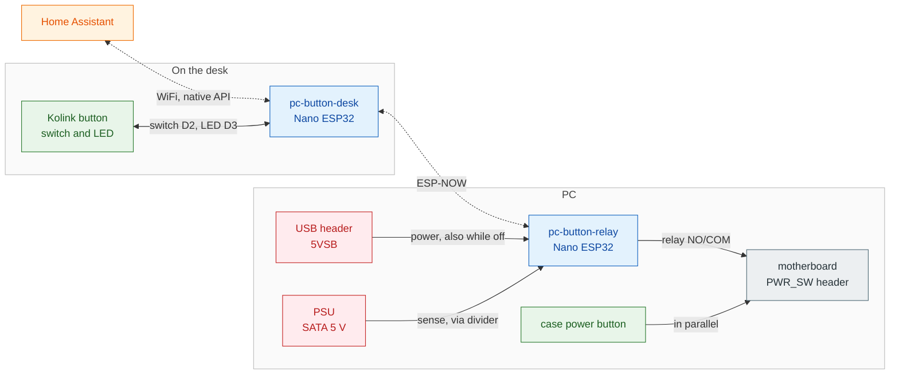

A button press, from the desk to the PC and back:

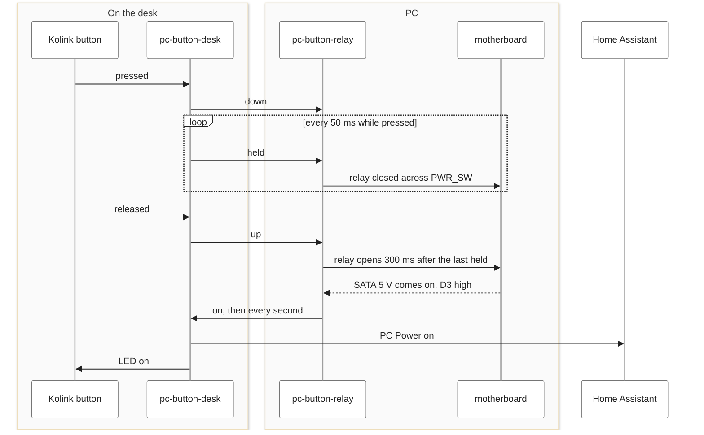

- **The press is repeated, not sent once.** While the button is held, the desk unit sends `held` every 50 ms; the relay unit keeps the relay closed while these arrive and opens it 300 ms after the last one. A lost frame changes nothing, and the relay can never stick closed: an ATX board forces the PC off after about 4 s of a held power switch.
- **The PC's state is repeated too.** The relay unit reports `on` every 1 s while the PC is on, so the LED and Home Assistant heal from a lost frame by themselves.
- **The relay unit keeps its WiFi off.** Inside a PC case the WiFi signal is often weak, and a weak WiFi connection keeps scanning for a better access point. WiFi and ESP-NOW share one radio, so every scan takes it off the ESP-NOW channel for seconds: short taps got through, held presses did not. So the relay unit runs on ESP-NOW alone, and switches WiFi on only for updates, through the Satellite WiFi switch in Home Assistant.
- **It finds its way back by itself.** The relay unit remembers the WiFi channel of its last WiFi session and uses it for ESP-NOW. If the link is lost for about 5 minutes, for example because the router changed its channel, it switches WiFi on, learns the new channel, and returns to ESP-NOW on its own. No channel is configured anywhere.

## Parts

**Parts**

| Part | Qty | For | Details |
|---|---|---|---|
| Solder wire | 1 | project | electronics solder wire; for both units |
| [Double-sided tape](https://www.3m.com/3M/en_US/vhb-tapes-us/) | 1 | project | 3M; VHB acrylic foam tape, 5 m roll; mounts both units, the desk unit under the desk and the relay unit inside the PC case |
| [Arduino Nano ESP32 with headers](https://docs.arduino.cc/hardware/nano-esp32/) | 2 | pc-button-desk ×1, pc-button-relay ×1 | Arduino; pc-button-desk: the headers keep every pin reachable in the case, for jumper wires; pc-button-relay: the headers keep every pin reachable in the case, for jumper wires |
| External power button with cable | 1 | pc-button-desk | Kolink KL-EXPWR; push button with a blue LED, 1.65 m cable; not on the maker's website |
| Resistor, 200 Ω | 1 | pc-button-desk | 200 Ω; LED series resistor, in the patch cable between D3 (GPIO6) and the button's blue LED; limits the current to a few mA, so PWM sets the brightness |
| Jumper wires | 2 | pc-button-desk ×1, pc-button-relay ×1 | Dupont jumper wires, one set |
| USB-C cable | 1 | pc-button-desk | USB-C, to the charger, with a slim plug; a thick plug may not fit the opening of the case |
| USB charger | 1 | pc-button-desk | USB power supply, 5 V |
| Heat-set insert | 14 | pc-button-desk ×5, pc-button-relay ×9 | M3, brass |
| Screw | 14 | pc-button-desk ×5, pc-button-relay ×9 | M3 × 4 mm; pc-button-desk: 4 for the lid, 1 for the clamp that holds the board; pc-button-relay: 4 for the lid, 1 for the clamp that holds the board, 4 for the relay module |
| Heat-shrink tubing | 6 | pc-button-desk ×1, pc-button-relay ×5 | one piece per joint; pc-button-desk: over the joint where the LED resistor is soldered; pc-button-relay: 1 on the SATA power cable; 2 on the Y-split inside the case (power and ground to both the board and the relay module); 2 on the Y-split outside the case at the power switch header, so the PC case's own power button keeps working next to the relay |
| Case | 1 | pc-button-desk | printed: [pc-button-desk-case.3mf](models/pc-button-desk-case.3mf) |
| 1-channel relay module | 1 | pc-button-relay | Purecrea; 5 V, SRD-05VDC-SL-C relay, optocoupler input; trigger jumper on high level, contacts NO and COM used (see the README); the maker has no product page |
| JST XH connector, 5 pins | 1 | pc-button-relay | 2.5 mm pitch, socket in the case and plug on the harness, with crimp contacts; the harness connects the case to the custom-made cable (see photos 02 and 03) |
| SATA power cable | 1 | pc-button-relay | a spare SATA power cable of the PSU, modified; cut down to the 2 wires needed; the other wires cut and sealed with hot glue at the connector |
| Resistor, 10 kΩ | 1 | pc-button-relay | 10 kΩ; PSU sense divider, high side, soldered inline on the SATA power cable from its 5 V wire to the junction |
| Resistor, 20 kΩ | 1 | pc-button-relay | 20 kΩ; PSU sense divider, low side, from the junction to the spliced ground wire; the junction goes to D3 (GPIO6) at 5 V × 20/30 = 3.33 V, low enough in value to dominate the pin's 45 kΩ internal pull-down |
| Hot glue | 1 | pc-button-relay | glue sticks for the hot glue gun; seals the cut wires of the SATA power cable |
| Super glue | 1 | pc-button-relay | cyanoacrylate glue; holds the JST XH socket in the case, which has no stop against pulling it out |
| Case | 1 | pc-button-relay | printed: [pc-button-relay-case.3mf](models/pc-button-relay-case.3mf) |

**Tools**

| Tool | For | Details |
|---|---|---|
| 3D printer | project | for both cases |
| Soldering iron | project | for the wires, and to set the heat-set inserts |
| Wire stripper | project |  |
| [Soldering tips for heat-set inserts](https://www.ruthex.de/en/products/ruthex-lotspitzen-einschmelzhilfe-m2-m2-5-m3-m4-m5-m6-m8) (optional) | project | ruthex LOE-SET-012; set the inserts straight |
| Heat gun (optional) | project | to shrink the heat-shrink tubing; a soldering iron works too |
| Multimeter (optional) | project | to check the sense divider, about 3.0 V at the relay unit's D3 with the PC on and 0 V with it off |
| JST XH crimping tool | pc-button-relay |  |
| Hot glue gun | pc-button-relay | to seal the cut wires of the SATA power cable |

**Requires**

- A motherboard USB header that stays powered while the PC is off: 5VSB; the relay unit lives on it. The BIOS must keep it powered in the off state (ErP disabled, or USB power in S5 enabled), or the button does nothing while the PC is off
- A spare SATA power cable of this PSU, or a free SATA plug: for the relay unit's modified SATA power cable, which senses whether the PC is on. Modular PSU cables are specific to their PSU on the PSU end; a cable from another PSU can destroy hardware

## Build

### Printing

| Part | Files | Printer | Profile | Filament | Layer height | Infill | Walls | Supports |
|---|---|---|---|---|---|---|---|---|
| `pc-button-desk` case | [3mf](models/pc-button-desk-case.3mf), [stl](models/pc-button-desk-case.stl) | Bambu Lab X1 Carbon 0.4 nozzle | ESP_desk - 0.16mm High Quality @BBL X1C | Bambu PETG HF @BBL X1C | 0.16 mm | 20% | 4 | none |
| `pc-button-relay` case | [3mf](models/pc-button-relay-case.3mf), [stl](models/pc-button-relay-case.stl) | Bambu Lab X1 Carbon 0.4 nozzle | ESP_desk - 0.16mm High Quality @BBL X1C | Bambu PETG HF @BBL X1C | 0.16 mm | 20% | 4 | none |
| all: pc-remote-power-button-cases | [3mf](models/pc-remote-power-button-cases.3mf) | Bambu Lab X1 Carbon 0.4 nozzle | ESP_desk - 0.16mm High Quality @BBL X1C | Bambu PETG HF @BBL X1C | 0.16 mm | 20% | 4 | none |

Both cases are sized for the Nano ESP32 with headers, so all pins stay reachable for jumper wires. A Nano without headers fits as well; the case is then a bit bigger than needed.

Print both cases lying flat, in PETG. A case printed standing on its end broke under finger pressure: every wall then consists of layer boundaries.

### Wiring

#### Desk unit

The button's own leads go straight onto the board's header pins: the switch pair on D2 and the GND next to it, the LED through a 200 Ω resistor on D3 and back to the other GND.

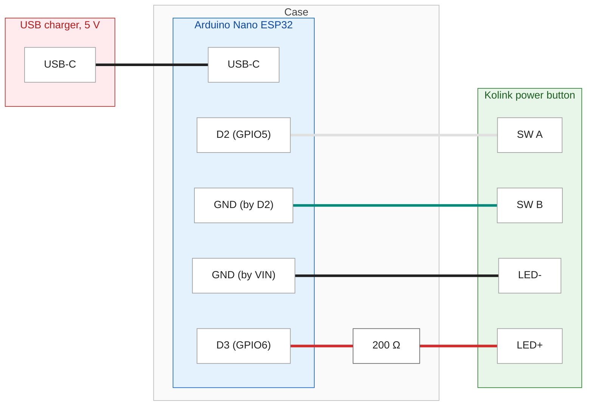

#### Relay unit

The relay unit connects to the PC through one 5-pin JST XH connector in its case wall: 5VSB and GND from a motherboard USB header, the sense line, and the power switch pair.

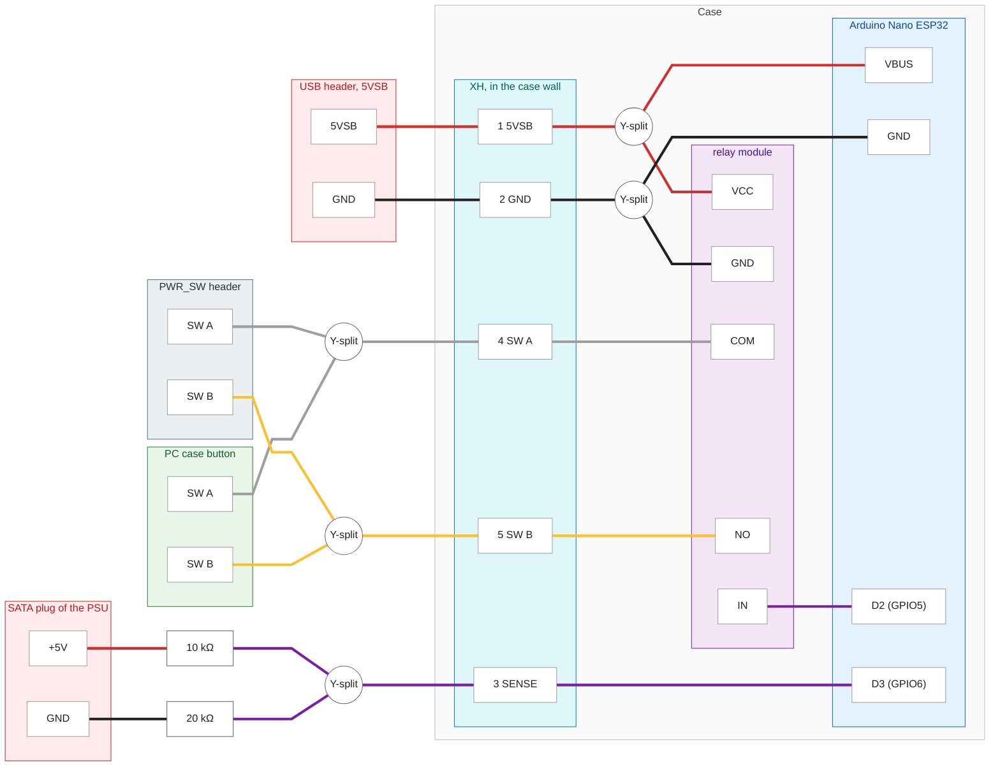

- **Relay module:** set its trigger jumper to high level, and use the contacts NO and COM. On low level, the relay would close during every boot and press the PC's power switch; on NC the switch would be held closed.
- **Power switch:** two Y-splits put the relay in parallel to the PC case's own button, on the motherboard's power switch header.
- **Power sense:** a 10 kΩ / 20 kΩ divider on the 5 V wire of a spare SATA power cable of the PSU gives about 3.3 V at D3 while the PC is on. Use a cable of this PSU only: modular PSU cables are specific to their PSU, and a cable from another PSU can destroy hardware.
- **Power supply:** 5VSB from a USB header that stays powered while the PC is off (BIOS: ErP disabled, or USB power in S5 enabled). VBUS is wired straight to the board's USB-C port, so unplug the harness before connecting a USB-C cable to the board.

### Assembly

- **Both cases:** the Nano ESP32 goes in USB-C end first, and a printed clamp, screwed on at the antenna end, holds it down. All header pins stay reachable, so the wiring plugs on with jumper wires. The lid is held by 4 M3 screws in heat-set inserts.
- **Desk unit:** shaking the case a little seats the board. The opening for the USB-C cable fits a slim plug. The button's cable is held by the pressure of the lid, which also relieves the strain on its leads.
- **Relay unit:** the relay module is held by 4 screws. The XH socket sits in the case wall; the case has a stop against pushing it in but none against pulling it out, so glue it in (cyanoacrylate).
- **Mounting:** double-sided tape holds both units, the desk unit under the desk and the relay unit inside the PC case.

### Flashing

The configurations are in [`esphome/`](esphome/), one standalone file per unit, for the [ESPHome](https://esphome.io/) dashboard, the Home Assistant add-on or the command line. They need ESPHome 2026.9.0 or newer, and Home Assistant: its Satellite WiFi switch is the only way to switch the relay unit's WiFi off after the first flash, and on for updates.

1. **Secrets:** copy [`esphome/secrets.example.yaml`](esphome/secrets.example.yaml) to `secrets.yaml` next to the configurations and fill in your WiFi. Give each unit its own API encryption key, for example from `openssl rand -base64 32`.
2. **First flash, over USB:** flash both units once. Each one logs its MAC address at boot (`Local MAC` in the WiFi section of the log).
3. **MACs:** each unit sends to the other one's MAC. Put the relay unit's MAC into the desk unit's configuration (`pc_button_relay_mac` in its `substitutions`), and the desk unit's MAC into the relay unit's (`pc_button_desk_mac`).
4. **Second flash:** the relay unit first, then the desk unit. Both units have to run the same release: the desk unit repeats its WiFi commands, which an older relay unit would answer by rebooting over and over.
5. **Home Assistant:** add the desk unit through the ESPHome integration, with its API key. The relay unit has no entities and needs no integration.
6. **WiFi off:** a newly flashed relay unit starts with WiFi on, so it can learn the channel. Once it has joined your WiFi, switch Satellite WiFi off in Home Assistant.

## Usage

- **Button:** press it to switch the PC on or off, as with the case's own button. Holding it for about 4 s forces the PC off.
- **LED:** lit while the PC is on.
- **Home Assistant** (desk unit):
  - *PC Power*: whether the PC is on.
  - *Satellite Link*: whether the desk unit hears the relay unit.
  - *Satellite WiFi*: the relay unit's WiFi. Switch it on to update the relay unit over the air, and off afterwards. The switch shows the relay unit's own report, not just the command.
- **Updating the relay unit:** switch Satellite WiFi on, wait until the relay unit is online, flash it, and switch Satellite WiFi off again. WiFi that cannot connect within 5 min switches itself off again.

## Known issues

- Both units must be flashed together, relay unit first: the desk unit's repeated WiFi commands would keep an older relay unit rebooting.
- WiFi reception inside a PC case can be too weak for the relay unit to hold a connection, so an OTA update may need the case opened or several attempts; the button itself does not depend on WiFi.
- While the relay unit is on WiFi, the ESP-NOW link is less reliable: WiFi scans take the shared radio off the channel.
- ESP-NOW frames are not authenticated: the units only accept frames from each other's MAC address, which a sender in radio range could imitate.
- Recovering the desk unit from a broken configuration needs USB, since it has no fallback access point.

## Previews

### Desk unit

The printed case body with threaded inserts, the lid and the small plate

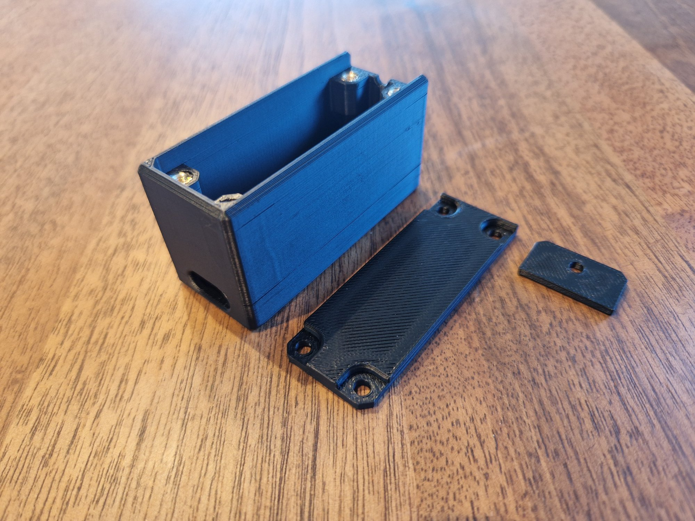

The Nano ESP32 in the open case, wired to the button cable

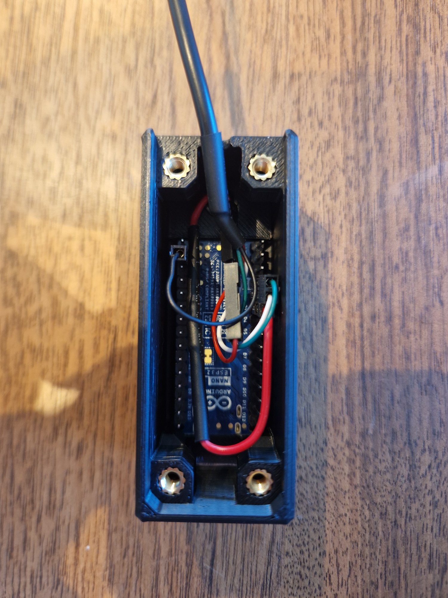

The closed case next to the key-switch power button

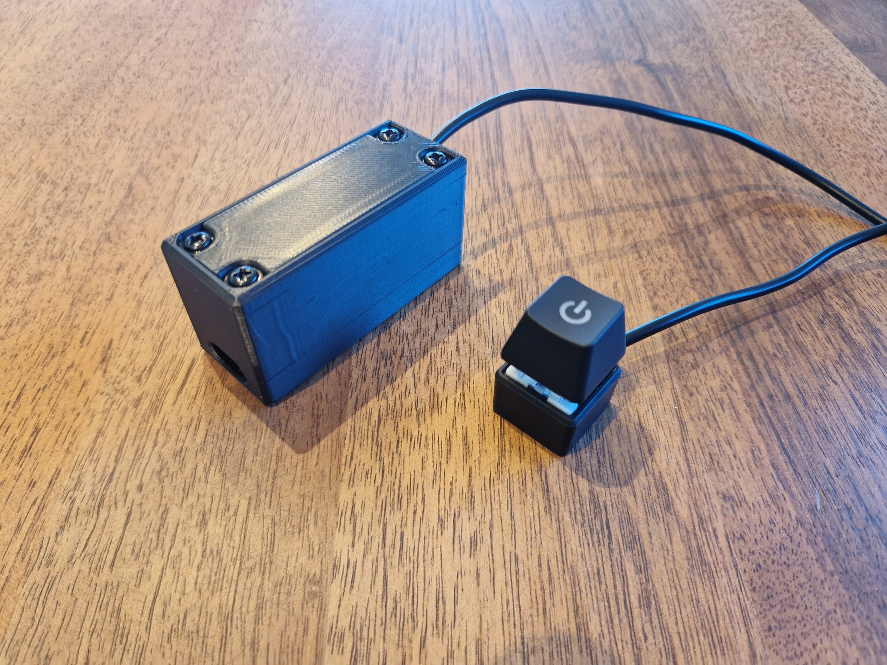

Mounted under the desk, the button lit blue while the PC is on

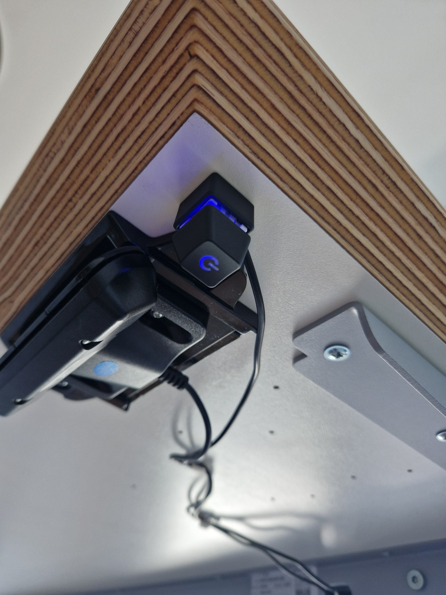

Section view of the case design in Fusion: the lid, the screw channels and the slot for the board

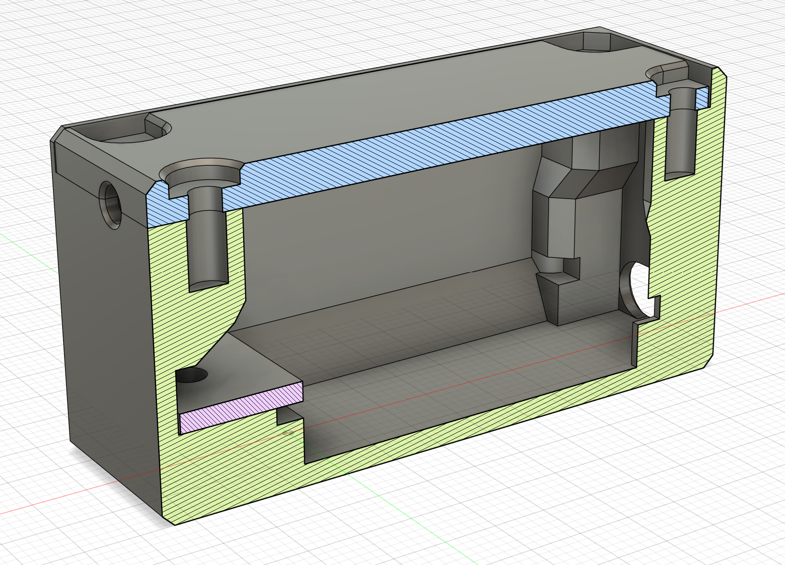

### Relay unit

The printed case body with threaded inserts, the lid and the small plate

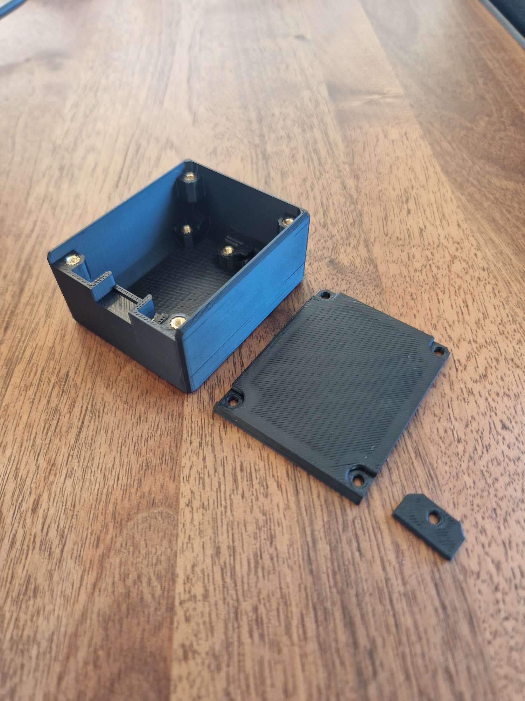

The relay module, the Nano ESP32 and the 5-pin connector in the open case

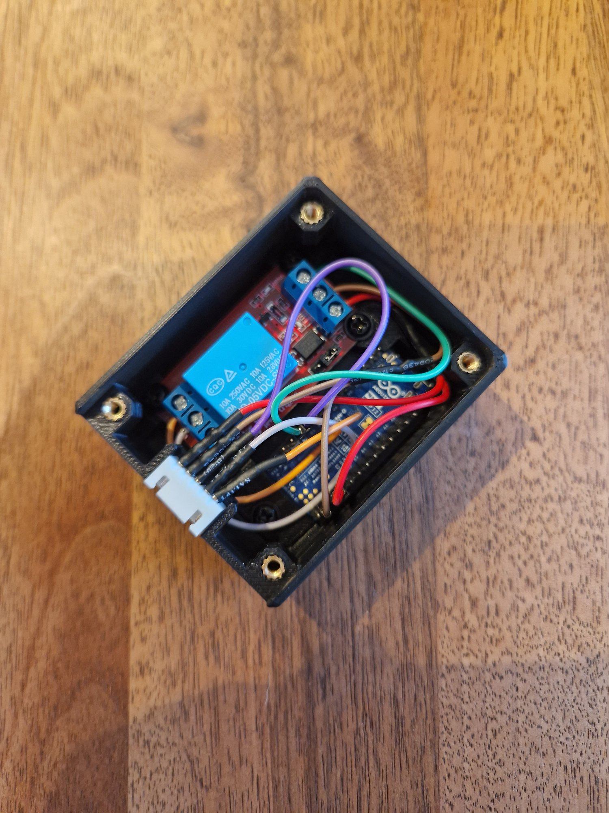

The closed case with the 5-pin harness to the motherboard headers

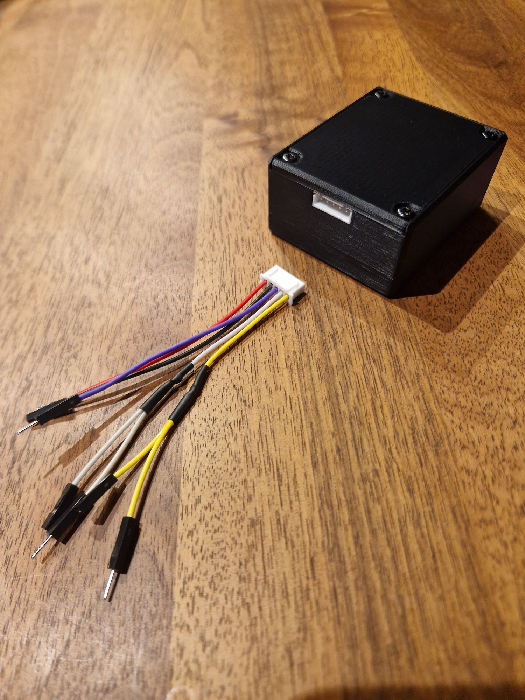

Installed inside the PC case, below the graphics card

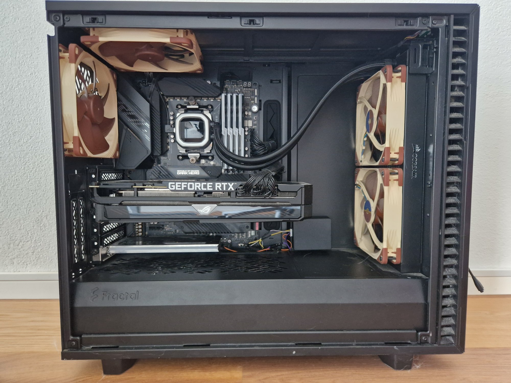

Section view of the case design in Fusion: the lid and the mounts for the relay module and the board

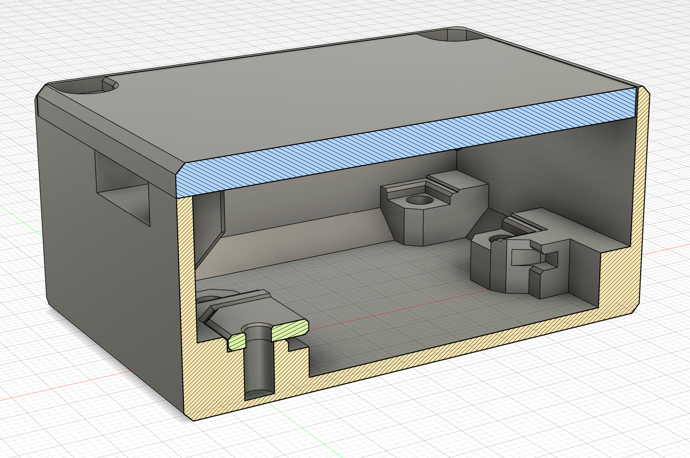

## Contributing

Contributions are welcome! You can help by:
- Suggesting improvements to the design or the firmware
- Testing it with other boards, cases or PCs, and sharing the results
- Improving the documentation

To contribute, open an issue or a pull request.

## License

This project is licensed under the [Creative Commons Attribution-NonCommercial-ShareAlike 4.0 International (CC BY-NC-SA 4.0)](https://creativecommons.org/licenses/by-nc-sa/4.0/) license, the configurations included.

You are free to:
- Share: copy and redistribute the material in any medium or format
- Adapt: remix, transform, and build upon the material

Under the following terms:
- Attribution: you must credit the creator.
- NonCommercial: you may not use the material for commercial purposes.
- ShareAlike: you must distribute your contributions under the same license.

## Contact

Questions, feedback, or suggestions? Open an [issue](../../issues).

## Disclaimer

This project is not affiliated with Kolink, Arduino, Espressif, ESPHome or Home Assistant. Working inside a PC and modifying PSU cables is at your own risk: disconnect the PC from mains power before opening it, and check the wiring before powering it again.
